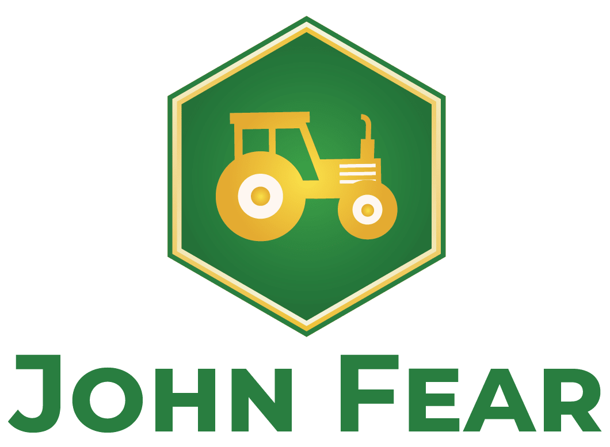

  
  <h3 align="center">_🦌_🚜💨_ Let John fear the deer</h3>

  

## General
JohnFear is an open source project with the goal to reverse engineer [John Deere][1] tractors. At first we will focus on exploiting the [CAN bus][2] system. [John Deere][1] follows the industry standard and uses the [J1939][9] protocol for the control unit intercommunication. As the [CAN bus][2] traffic is not encrypted, we assume that this is the best entry point for the vehicle exploitation.

Please keep in mind that this project is a **work in progress** and the advancements are limited by our time and money.

## CAN basics
Sorry guys but we will not explain the [CAN bus][2] in detail here.  

In a nutshell: the most important aspect is the **broadcasting** of all messages, which allows us to sniff all the data and analyze it offline.

We suggest checking out some tutorials before you continue reading. Google is your friend here and will provide you with a solid foundation of the knowledge needed in this project.

* [Wikipedia][2]
* [Tractor Hacking][5]
* [CSS electronics][8]

The main takeaway should be that [CAN bus][2] is used as a physical layer for transporting [J1939][9] messages.

## J1939
Since you've finished absorbing the [CAN basics][2] section, we assume you are pretty much an expert now. Nevertheless, let's check out what [J1939][9] is used for.

In a nutshell [J1939][9] defines the vehicle messages and is published by the [SAE][10] (Society of Automotive Entineers). The entire standard is published within multiple papers but we will only focus on the J1939/71, which describes the PGNs (Parameter Group Numbers) and SPNs (Suspect Parameter Numbers). 

We recommend going through this [guide](https://www.csselectronics.com/screen/page/simple-intro-j1939-explained).

Another good explanation can be found [here][11] and [here][12].

## Related work
There is already some work out there, therefore we also haven't started entirly from scratch. Please checkout [Tractor Hacking][5] from the California Polytechnic State University, which is also an open source project. You can find some sniffed data in their GitHub repository as well. In addition, they have already written a client application in Python ([PolyCan][6]). In our opinion, this tool is not needed in this project because Wireshark provides us already with the necessary information.

We also recommend having a look at [CSS electronics][8]. Unfortunately, they only offer a commercial project, but you can find really good explainations of the subject on their site.

## Goals
At the moment, the goal of this project is not entirely clear. We will try to keep exploiting the traktor as far as possible.

###  First goal
At first, we will focus on sniffing only. The goal is to sniff and decode the [J1939][9] messages in real time with wireshark. This is already available by [CSS electronics][8], but let's get it done open source.

Please check out our tutorial on how to [sniff CAN bus data](./docs/howToCapture.md).

## Contributors ✨

Thanks goes to these wonderful people:

<!-- ALL-CONTRIBUTORS-LIST:START - Do not remove or modify this section -->
<!-- prettier-ignore-start -->
<!-- markdownlint-disable -->
<table>
  <tr>
    <td align="center"><a href="https://github.com/whati001"> <b>whati001</b></a> <a href="#question" title="Answering Questions">💬 </a><a href="#infrastructure" title="Infrastructure (Hosting, Build-Tools, etc)">🚇</a> <a href="#maintenance" title="Maintenance">🚧</a></td>
    <td align="center"><a href="https://github.com/GatCode"> <b>GatCode</b></a> <a href="#question" title="Answering Questions">💬 </a><a href="#infrastructure" title="Infrastructure (Hosting, Build-Tools, etc)">🚇</a> <a href="#maintenance" title="Maintenance">🚧</a></td>
  </tr>
</table>

[1]: (https://www.deere.com/en/index.html)
[2]: (https://en.wikipedia.org/wiki/CAN_bus)
[3]: (https://github.com/GatCode)
[4]: (https://github.com/whati001)
[5]: (https://tractorhacking.github.io/)
[6]: (https://github.com/TractorHacking/PolyCAN)
[7]: (https://www.wireshark.org/)
[8]: (https://www.csselectronics.com/screen/overview)
[9]: (https://en.wikipedia.org/wiki/SAE_J1939)
[10]: (https://www.sae.org/)
[11]: (https://obd2allinone.com/products/j1939-t2adap.asp)
[12]: (https://copperhilltech.com/a-brief-introduction-to-the-sae-j1939-protocol/)
