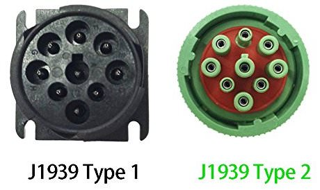

# Hardware
This page, will give you an overview on all tools we used in our project.

## Computer
Since we ran into an issue with Apples System Integrity Protection (SIP) in combination with Wireshark (MacBook Pro), we opted to use a Dell Latitude 7480 with Arch Linux x64 (5.5.10-arch1-1) as the operating system.

## CAN connector
We decided to go with the same tools as the [Tractor Hacking][1] team. Therefore we used the CANable Pro from [canable][2]. Please keep in mind that the PRO version is not necessary to exploit the CAN system. The main requirement is to make sure you use a device which supports the maximum baud rate of the CAN connector itself (500kbits/s).

### CANable PRO
If you use the CANable PRO, you have two firmware options:

* slcan (default)
* candlelight

We decided to use candlelight firmware because it simplifies the process if you want to use [Wireshark][3]. Insted of creating a serial interface with [can-utils][4], the candlelight firmware allows the device itself to act as a native serial device (e.g. like your wifi card).

#### Flashing candlelight
For the flashing process, we used the online updater provided by candlelight. This process was straight forward and very fast: just connect the device to your computer, open your browser (ensure that the browser has permission to read your devices) and update the firmware. In case of the CANable PRO, you also need to hold down the 'Boot' button to bring up the bootloader.

After successful flashing, your device should be visible at `/dev/can*` and in [Wireshark][3] as well.

#### Setting the jumper
The CANable PRO also includes a jumper to enable or disable the termination resistor. Recap: [CAN bus][5] needs to be terminated! You can forget about the termination itself since John Deere already did this - ensure to disable the termination resistor.

## J1939 cable
Please feel free to use any type of J1939 cable. 

Currently there two types of cables on the market: type1 and type2. Generally type1 is color coded in black and type2 in green.

Nevertheless in our case (John Deere 6125R), the female connector was coded black but the type was type2. 

Both connectors look nearly identical, the main difference being one pin with varying diameter. Therefore a type1 male connector can **not** be connected to a type2 female connector but vise versa. 

A good explanation on this topic can be fond [here][6]. Just compare the CAN socket of your tactor with the one on the web page and you will find the type you need. 

### Baudrate
Usually the connector type also defines the baud rate:

* type1 -> 250kbits/s
* type2 -> 500kbits/s

If this baudrate is mismatched, you will retrieve a **bus violation error** in rapid paste! We faced this issue many times and without any side effects. After disconnecting the board, we were able to start the tractor normally.

Concluding: a mismatched baud rate is harmless!

(generally all heavy duty trucks build from 2016 on should use type2)

### Pinout
Please refere to [this][6] page for further information.

Generally, there is no need to connect the GND pin! The two necessary signal lines are `CANH` and `CANL`. If you connect them in the wrong order, nothing should happen but you also won't be able to sniff any meaningful data.

  

(image above copied from: [https://guatemaladigital.com/](https://guatemaladigital.com/Automotriz+-+sistema+el%E9ctrico/Producto.aspx?CodigoP=B07DC6C72B))

[1]: (https://tractorhacking.github.io/)
[2]: (https://canable.io/)
[3]: (https://www.wireshark.org/)
[4]: (https://github.com/linux-can/can-utils)
[5]: (https://en.wikipedia.org/wiki/CAN_bus)
[6]: (https://obd2allinone.com/products/j1939-t2adap.asp)
