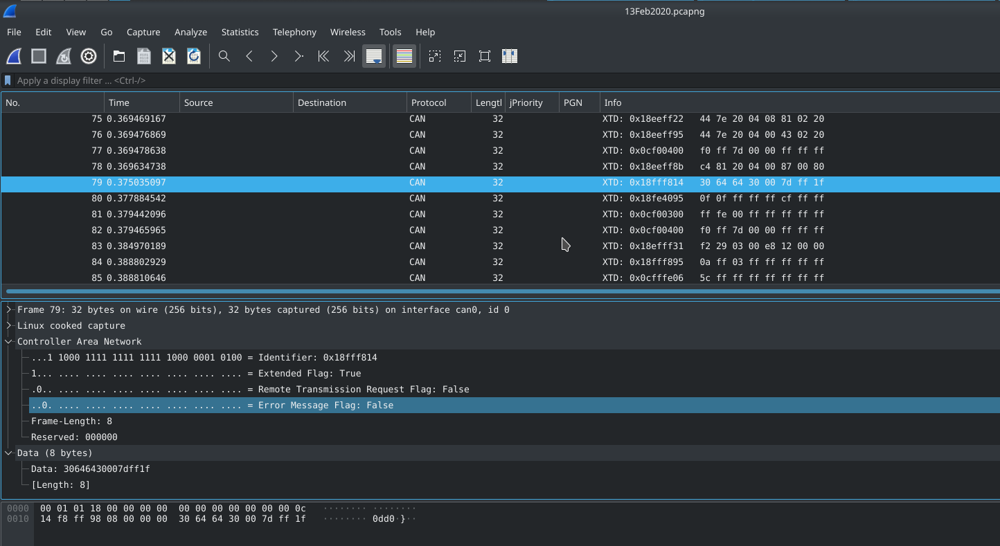

# How to capture
This chaper shows how we captured the CAN data with the [CANable PRO][1] board. Please take a look at the [hardware chapter](./hardware.md) for more information about the board as well as the firmware and the computer.

To start the capturing, proceed with the following steps!

## Step 1: Interface
Make sure that the board as well as the wiring is setup correctly before you proceed.

First, connect the board to the computer (NOT TO THE TRAKTOR). To enable the device (candlelight firmware), the following commands can be used:

```
  # command generic
  ip link set <devicename> up type can bitrate <baudrate>;
  ip link set down <devicename>
  
  # set interface down if up
  ip link set down can0

  # j1939 type1
  ip link set can0 up type can bitrate 250000;

  # j1939 type2
  ip link set can0 up type can bitrate 500000;

  # check links - should appear here now
  ip link show
```

If no error occured, the `can0` device is now ready for Wireshark.

Now you can connect the board to the tractor, we recommend you to do this when the engine is off.

## Step 2: Wireshark
Start [wireshark][2] and start a new capture (select the CAN device - e.g. `can0`).

## Step 3: Start Engine
Fire up the engine of the tractor. Note that to capture CAN messages, it should be enough to start board computer without the engine. To retrieve all messages, continue starting the engine. If the only messages you see are bus valuation messages, you may have used the wrong baudrate.

## Step 4: Trace data
After starting the engine, Wireshark should show all messages in raw [CAN bus][3] format. Please take a look at the example screenshot below. 



[1]: (https://canable.io/)
[2]: (https://www.wireshark.org/)
[3]: (https://en.wikipedia.org/wiki/CAN_bus)